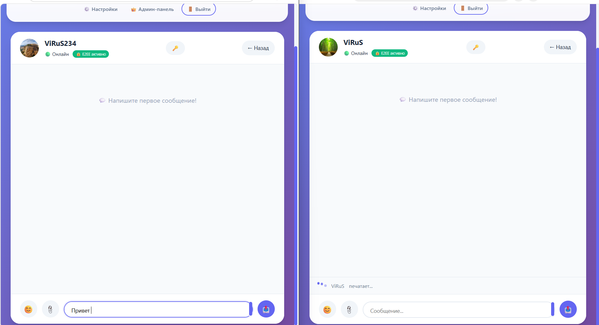
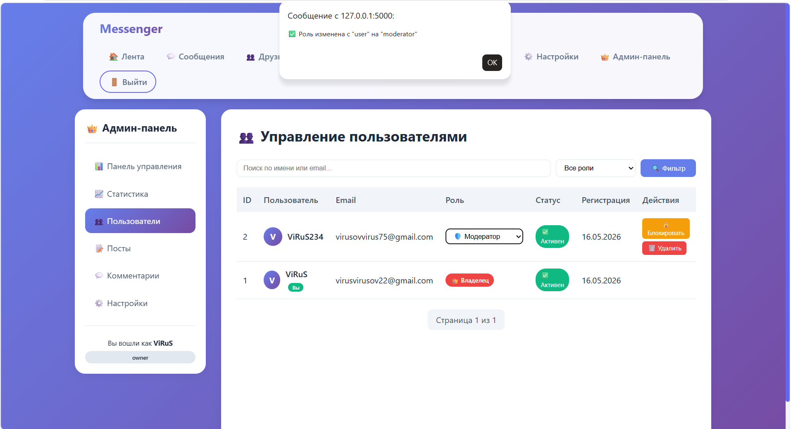
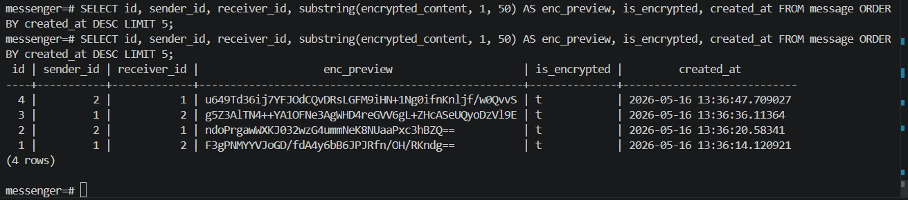

# 🔐 Messenger – Encrypted Web Messenger with Social Features

A modern, real‑time messenger built with Flask and WebSocket, featuring **end‑to‑end encryption (E2EE)**, two‑factor authentication, a social feed, friend management, and an admin panel.  
Fully containerised with Docker Compose, ready for demonstration or production use.

---

## ✨ Key Features

- **End‑to‑End Encryption (E2EE)**  
  ECDH + AES‑256‑GCM encryption performed entirely in the browser. Private keys are password‑protected and stored in IndexedDB. The server never sees plain‑text messages.

- **Real‑Time Chat**  
  WebSocket communication with typing indicators, read receipts, stickers, file attachments, and reactions.

- **Two‑Factor Authentication (2FA)**  
  TOTP‑based 2FA via apps like Google Authenticator.

- **Social Feed**  
  Create, edit, like, and comment on posts. Only friends see each other’s content.

- **Friend System**  
  Send, accept, reject, and remove friend requests. Chat is only possible between friends.

- **Admin Panel**  
  Manage users, assign roles (owner/admin/moderator), ban/unban, delete users/posts/comments.

- **Email Verification & Password Reset**  
  Account activation and password recovery via SMTP.

- **Dark Theme & Responsive Design**  
  Toggle between light and dark modes, mobile‑friendly interface.

- **Progressive Web App (PWA)**  
  Service worker for offline caching and installability on mobile devices.

- **Docker Support**  
  Quick deployment with PostgreSQL, Redis, and the application bundled in Docker Compose.

## 📸 Screenshots

| Chat with E2EE | Admin Panel | Encrypted DB |
|----------------|-------------|--------------|
|  |  |  |

Encrypted Web Messenger with E2EE, 2FA, and Social Features

🔐 End-to-end encryption (ECDH + AES-256-GCM)
💬 Real-time chat with file attachments & stickers
👑 Admin panel with role management
🐳 Docker-ready deployment
✅ 30+ automated tests included

Tech: Python/Flask, PostgreSQL, Redis, WebSocket, Docker

---

## 🧰 Technology Stack

| Layer          | Technology                           |
|----------------|--------------------------------------|
| Backend        | Python 3, Flask, Flask‑SocketIO      |
| Database       | PostgreSQL (via SQLAlchemy + Flask‑Migrate) |
| Message Broker | Redis (WebSocket pub/sub)            |
| Security       | Flask‑WTF (CSRF), Flask‑Limiter, PyOTP (2FA), RSA/AES‑GCM (E2EE) |
| Frontend       | Vanilla JavaScript, Socket.IO client |
| Deployment     | Docker, Docker Compose               |

---


## 📮 Contact / Purchase

Interested in buying this project or have questions?

- **Telegram:** [@virus_messeger_dev](https://t.me/virus_messeger_dev)
- **Email:** [virusvirusov22@gmail.com](mailto:virusvirusov22@gmail.com)
- **GitHub Issues:** Feel free to open an issue in this repository.

---

## 📝 License

This project is licensed under the MIT License.  
Upon purchase, you will receive full source code and a perpetual license to use, modify, and distribute the software.

---

## 💰 How to Purchase

1. Contact me via Telegram or Email (see above).
2. We agree on price and terms.
3. Payment via [USDT / Bank Transfer / Escrow service like Flippa].
4. You receive full source code (Git repository access).
5. I provide 7 days of support for setup and deployment.

**Price: $4,500** (negotiable)


## 🚀 Quick Start

### 1. Clone and configure

```bash
git clone <your-repo-url>
cd messenger
cp .env.example .env
# Generate a strong secret key:
python3 -c "import secrets; print(secrets.token_hex(32))"
# Insert the generated key into .env as SECRET_KEY=...

 2. Start services
```bash
docker-compose up -d --build

 3. Create the owner account
```bash
docker exec -it messenger_app python create_owner.py


messenger/
├── app.py                # Main Flask application
├── models.py             # SQLAlchemy models
├── auth.py               # Authentication helpers
├── admin.py              # Admin blueprint
├── create_owner.py       # Owner creation script (interactive)
├── docker-compose.yml    # Docker services
├── requirements.txt      # Python dependencies
├── templates/            # Jinja2 templates (chat, feed, admin, etc.)
├── static/               # CSS, JS, avatars, Service Worker
└── tests/                # Test suite

